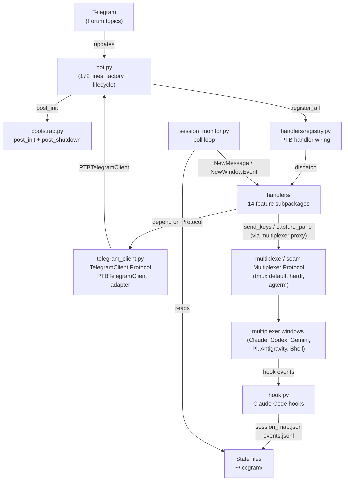
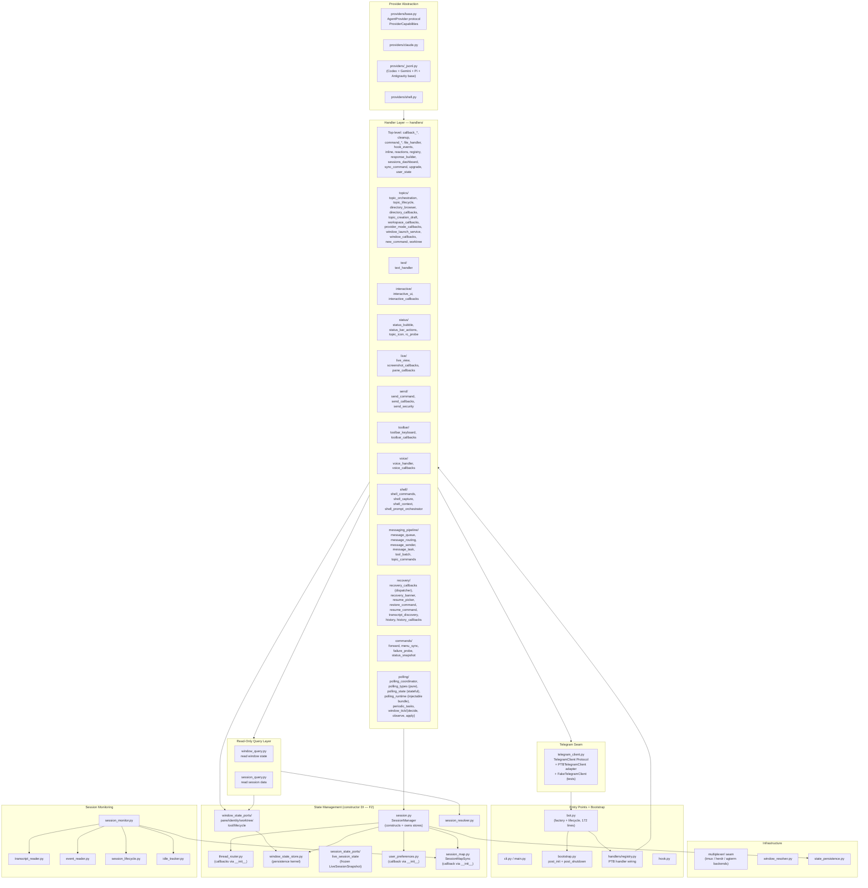
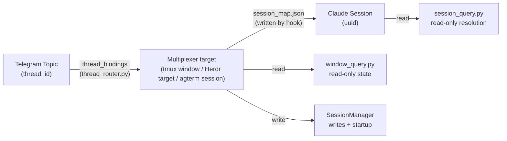
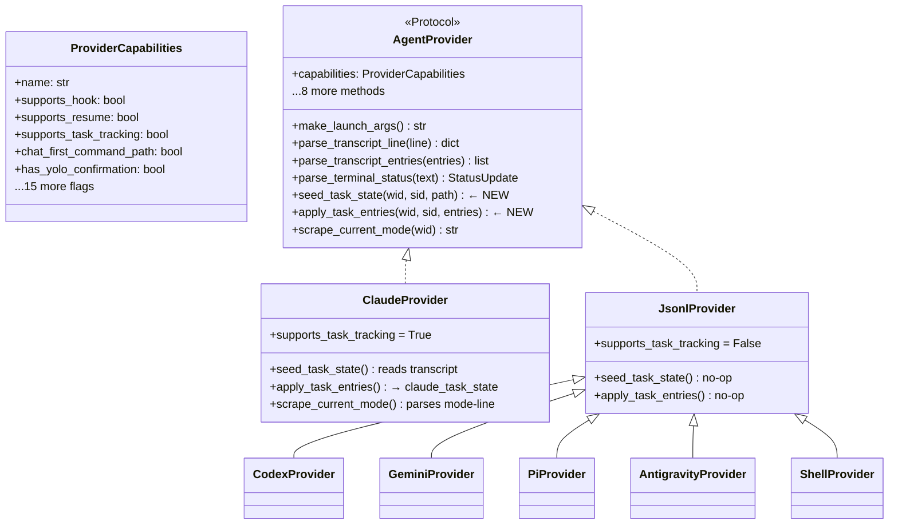
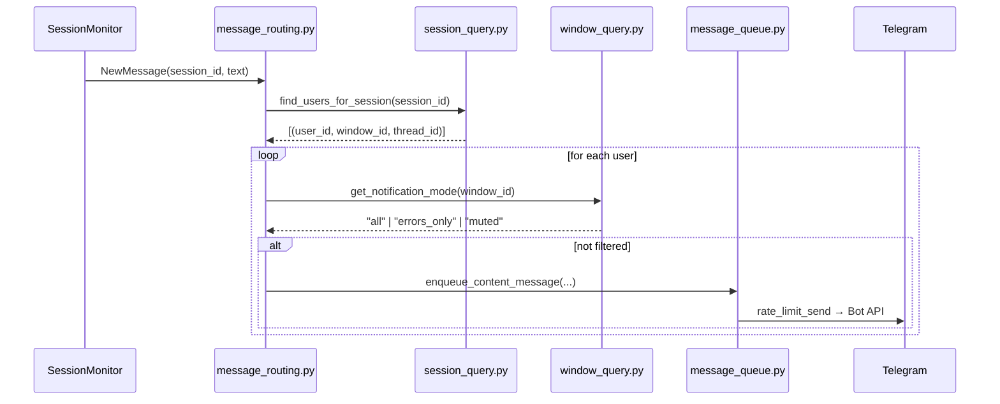
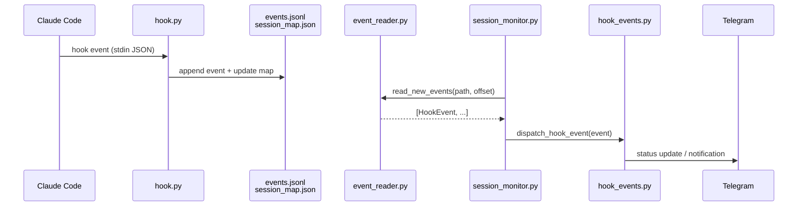
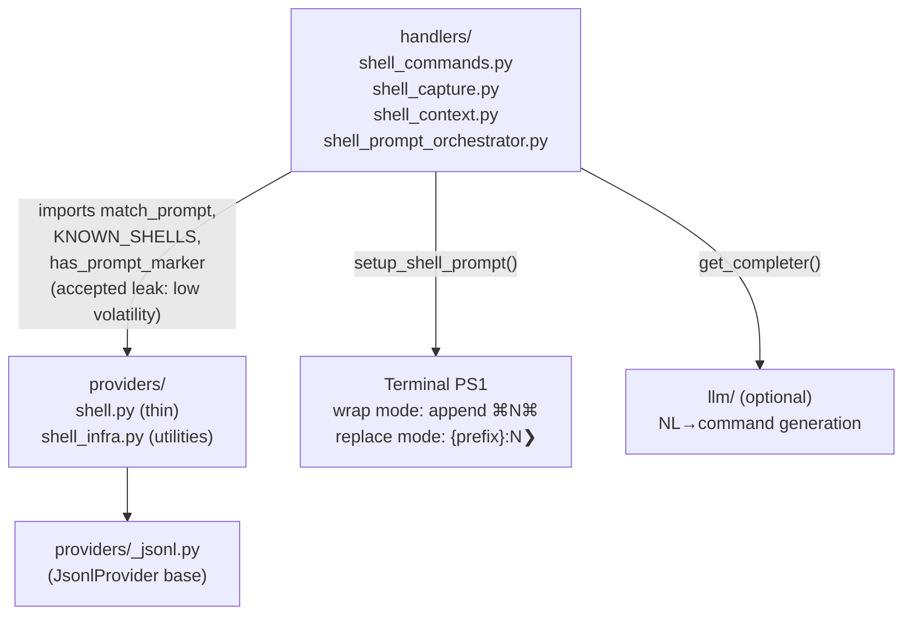
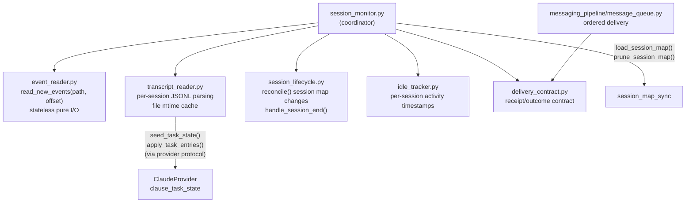

# ccgram Architecture

Generated from code state 2026-08-31.

## Herdr compatibility

The Herdr adapter accepts socket protocols 14–22 without warnings and attempts compatible operations with a warning for other versions. Terminal operations and hook identity reads use the public JSON socket API; the CLI is used for socket discovery when no endpoint is configured. Pi requires `herdr integration install pi`; Antigravity requires `herdr integration install antigravity-cli`. Agents must be started or restarted after installation to load the integration and publish their `agent_session` identity. Sessionless detections fail closed and do not receive persistent topics. Antigravity reports its identity after the first prompt creates a conversation.

## agterm compatibility

[agterm](https://github.com/umputun/agterm) is macOS-native. Its adapter drives the `agtermctl` CLI through agterm's local control socket. An agterm session UUID is the neutral `window_id`; agterm persists that UUID across restarts, so no alias reconciliation is required. Discovery defaults to the `ccgram` workspace and can be scoped with `CCGRAM_AGTERM_WORKSPACES`; agterm supports workspace selection for new sessions.

## System Overview

ccgram maps each Telegram Forum topic to one terminal-multiplexer target running one agent CLI (Claude Code, Codex, Gemini, Pi, Antigravity, or Shell). Tmux routing remains keyed by window ID (`@0`, `@12`). Herdr routing is keyed only by opaque `herdr-session-v1-…` targets derived from `agent.list`; tab, pane, terminal, workspace, display, and focus values are short-lived locators inside a fresh guarded action, never persisted identity. Every Herdr session displays one pane-qualified topic, independent of sibling count. Missing, malformed, sessionless, and legacy targets fail closed; duplicate canonical targets are quarantined without disabling unrelated sessions; raw locator aliases and display-name recovery are never implicit. A target can change after the guard and before Herdr dispatches, so the adapter records a possible post-guard race rather than claiming atomic delivery. agterm routing is keyed by its durable session UUID. Multiplexer access goes through the `multiplexer/` seam (`Multiplexer` Protocol); tmux is the default backend, while herdr and agterm are selectable with `CCGRAM_MULTIPLEXER=herdr` and `CCGRAM_MULTIPLEXER=agterm`, respectively.

## Module Layers

## State Flow: Topic → Target → Session

For Herdr, the topic binding is an opaque guarded session target, not a window or pane. `multiplexer/herdr.py` alone parses `agent.list`, derives the digest, and uses the matched live locator for one action. A shared tab is projected as one pane-qualified topic per agent. Legacy tab/pane/terminal bindings are persisted as `legacy_herdr`, blocked, and retained only for archive/rollback until an explicit rebind.

For agterm, the topic binding and neutral `window_id` are the same durable session UUID. `multiplexer/agterm.py` keeps agterm's private tree and surface locators inside the adapter; it does not expose a durable sibling-pane handle.

## SessionManager Responsibilities

`SessionManager` constructs and owns the four state stores (`WindowStateStore`, `ThreadRouter`, `UserPreferences`, `SessionMapSync`) via constructor DI with explicit `schedule_save` callbacks. Its public surface is now small: startup orchestration (`__post_init__`, `resolve_stale_ids`), write coordination (`set_window_provider`, `set_window_cwd`, `set_*_mode`, `set_display_name`), and cross-cutting audit (`audit_state`, `prune_stale_state`, `prune_stale_window_states`).

Read paths bypass `SessionManager`:

- `window_query.py` — `get_window_provider()`, `get_approval_mode()`, `get_notification_mode()`, `view_window()`; feature-shaped reads delegate to `window_state_ports/*`.
- `window_state_ports/` — `pane_state`, `identity_state`, `worktree_state`, `tool_state`, `lifecycle_state`. Frozen projection dataclasses for handlers and Mini App, plus cohesive feature writes (pane upsert/remove/lifecycle, worktree metadata, batch mode, tool-call visibility, origin). Provider/session identity writes still delegate to `SessionManager.set_window_provider`.
- `session_query.py` — `resolve_session_for_window()`, `find_users_for_session()`, `get_recent_messages()`.
- `session_map_sync` (direct imports) — `load/prune/register`.
- `thread_router` (direct imports) — `get_display_name()`.

`WindowStateStore` remains the single persistence kernel for `WindowState`. Handler and Mini App reads of window state go through `window_query` or `window_state_ports/*` — never raw `WindowState` fields. Boundary enforced by `tests/ccgram/test_window_state_access_audit.py` (raw feature-field access permitted only in `window_state_store.py`, `window_state_ports/*`, `session.py`, `window_query.py`, and serialization tests) and `tests/ccgram/test_query_layer_only_for_handlers.py` (write/admin allow-list).

## Provider Protocol

## Message Routing Flow

## Delivery Queue, Progress, and Watermarks

Transcript `NewMessage` events route into a per-user ordered queue. Consecutive text tasks can share one Telegram send only when they are non-empty, one-part text from the same chat, thread, window, role, and source session; the queue stops at every other boundary. Each part is converted to Telegram entities before assembly, then separated with a blank line and sent as one formatted payload. This preserves each source item's rendering and prevents Markdown/entity state from crossing items. Tool batching, status tasks, media/TTS, and skip notices retain their separate delivery boundaries.

Queue telemetry is window/topic scoped: pending transcript content tasks include queued and in-flight tasks, oldest age is measured from enqueue time, and delivery lag is measured when a content attempt reaches the Telegram boundary. Only at `pending >= 100 OR oldest_age >= 300s` does the status bubble render these values and offer the inline Jump-to-live confirmation; healthy telemetry remains in structured service logs. The metrics are deliberately in-memory telemetry, not durable state.

Transcript state keeps a persisted delivered watermark and an in-memory parsed offset. The monitor advances the watermark over each session's longest leading run of receipts that were delivered or intentionally dropped; the first failed or unconfirmed receipt fences the remainder for replay. This keeps the contract at-least-once while allowing durable progress during sustained output. A confirmed Jump to live snapshots source EOF, persists a `BacklogSkipIntent` before source-scoped queue retirement, and waits for the visible skipped-range notice receipt before atomically advancing the watermark. The raw transcript is not changed. Pending barriers survive restart and block rereading the frozen range until their notice is delivered.

## Hook Event Flow

## Shell Provider Architecture

## Session Monitoring Architecture

## Key Design Decisions

<!-- markdownlint-disable MD060 -->

| Decision                                          | Rationale                                                                                                                                                                                                                                                                                                                                                                                                                                             |
| ------------------------------------------------- | ----------------------------------------------------------------------------------------------------------------------------------------------------------------------------------------------------------------------------------------------------------------------------------------------------------------------------------------------------------------------------------------------------------------------------------------------------- |
| Window ID-centric routing (`@0`, `@12`)           | Unique within a tmux server; window names are display-only                                                                                                                                                                                                                                                                                                                                                                                            |
| Hook-based event system                           | Instant stop/done/notification detection without terminal polling; events appended to `events.jsonl` and consumed incrementally. Each monitor cycle reconciles live window aliases before consuming events, so a canonical Herdr hook key routes to the topic migrated from its superseded target.                                                                                                                                                    |
| Delivered transcript watermark                    | The transcript reader advances only an in-memory parsed offset. Dependency-light `delivery_contract` owns receipts/outcomes; `message_queue` settles every queued transcript task, and the monitor persists each session's longest settled receipt prefix. The first failed or pending receipt fences later work for replay. Core monitoring never imports handler implementations.                                                                   |
| `window_query` / `session_query`                  | Handlers read window/session state via free functions, never importing `SessionManager`. Direct `session_manager.<attr>` in `handlers/**` is restricted to a documented write/admin allow-list                                                                                                                                                                                                                                                        |
| `window_state_ports/` feature ports               | `WindowStateStore` is the single persistence kernel; `window_state_ports/{pane,identity,worktree,tool,lifecycle}_state` are thin adapters exposing frozen projections plus cohesive feature writes. Raw `WindowState`-field access outside the kernel, the ports, `session.py`, `window_query.py`, and serialization tests fails `test_window_state_access_audit.py`. Provider identity writes still delegate to `SessionManager.set_window_provider` |
| Provider protocol with capability flags           | Gate UX features (resume, continue, hooks, YOLO, mode scraping, RC, picker hints) without `if provider == "claude"` checks                                                                                                                                                                                                                                                                                                                            |
| `supports_task_tracking` capability               | `transcript_reader` is provider-agnostic; only Claude implements task state                                                                                                                                                                                                                                                                                                                                                                           |
| Tool-call visibility on `WindowState`             | Per-window `tool_call_visibility` (`default`/`shown`/`hidden`) gates `_handle_content_task` before batch eligibility; hook events bypass                                                                                                                                                                                                                                                                                                              |
| Status-mode color schemes                         | `CCGRAM_STATUS_MODE` selects `system` (green = working) or `user` (green = ready) — only emoji rendering changes, not internal state names                                                                                                                                                                                                                                                                                                            |
| Gemini JSONL incremental reads                    | Gemini CLI v0.40+ uses append-only JSONL; provider inherits `JsonlProvider` byte-offset reader, dedupes by message id and pending tool_use                                                                                                                                                                                                                                                                                                            |
| Viewport screenshots                              | `/screenshot` and 📷 capture the current viewport with ANSI color; live view uses the same viewport capture at a smaller font size. `/last` (📄 Last toolbar button) delivers the last assistant reply text (AI providers, from transcript) or last command+output block (shell) as a message or `.txt` attachment for overflow                                                                                                                       |
| Picker hints                                      | `ProviderCapabilities.tui_picker_commands` lists modal-opening slash commands; `forward._picker_hint()` adds a hint pointing at `/toolbar` when one is forwarded, with the hint text adapted to the resolved `ToolbarLayout`                                                                                                                                                                                                                          |
| `handlers/` feature subpackages                   | Handlers are grouped into 14 feature subpackages; each `__init__.py` re-exports the public surface                                                                                                                                                                                                                                                                                                                                                    |
| Constructor DI for stores                         | `SessionManager` constructs `WindowStateStore`/`ThreadRouter`/`UserPreferences`/`SessionMapSync` with explicit `schedule_save` callbacks; no `_wire_singletons` and no silent unwired defaults — `register_*_callback` fails loud                                                                                                                                                                                                                     |
| `bot.py` is a factory + lifecycle only            | 172 lines; `handlers/registry.py` owns PTB handler wiring; `bootstrap.py` owns `post_init` (ordered: `register_provider_commands` → `verify_hooks_installed` → `wire_runtime_callbacks` → `start_session_monitor` → `start_status_polling` → `start_miniapp_if_enabled`) and `post_shutdown`                                                                                                                                                          |
| `window_tick/decide,observe,apply`                | Pure decision kernel (`decide.py`, zero deps on tmux/PTB/singletons) + pure observer (`observe.py`, `TickContext` out) + side-effect applier (`apply.py`); `decide_tick` is unit-tested without mocks                                                                                                                                                                                                                                                 |
| `TelegramClient` Protocol                         | Handlers depend on `TelegramClient` not `telegram.Bot`; `PTBTelegramClient` adapts in production, `FakeTelegramClient` records in tests. Only `bot.py`, `bootstrap.py`, `handlers/registry.py`, `telegram_client.py`, `telegram_rate_limiter.py`, `telegram_request.py`, `telegram_sender.py` import from `telegram.ext` at runtime                                                                                                                   |
| Pure types vs stateful polling                    | `polling_types.py` holds contracts (stdlib + `providers.base.StatusUpdate` only); `polling_state.py` holds strategies + module-level singletons; `decide.py` imports only from `polling_types`. Pinned by `test_polling_types_purity.py`                                                                                                                                                                                                              |
| Injectable `PollingRuntime` bundle                | The five polling strategy instances are bundled in `polling_runtime.PollingRuntime`. `get_default_runtime()` wraps existing singletons (no re-registration). `PollingRuntime.create()` builds an isolated bundle for tests. `tick_window`, `observe`, and `apply` accept `runtime: PollingRuntime \| None = None`. Import direction: `polling_runtime` → `polling_state` only. Gate: `test_polling_runtime.py`                                        |
| `session_state_ports/` live-session read contract | Volatile live-session reads (task snapshot, wait header, session-id, last-activity) go through `session_state_ports/live_session_state.py`. Direct handler imports of `get_claude_task_snapshot`, `get_claude_wait_header`, or `claude_task_state.has_snapshot` are banned. Write authority stays in `session_lifecycle`. Gate: `test_session_state_ports_audit.py`                                                                                   |
| State-file contracts in `hooks/state_files.py`    | `EventLogRecord`/`SessionMapEntry` are the canonical record types for `events.jsonl` and `session_map.json`. All production writes use `serialize_*`; all reads use `parse_*`. File I/O and locking stay in `hook.py`/`session_map.py`. `state_files.py` is stdlib-only                                                                                                                                                                               |
| Topic-creation seam split                         | `directory_callbacks.py` is a thin dispatcher; `topic_creation_draft.py` owns the 14 flow-state keys; `workspace_callbacks.py` handles workspace picker; `provider_mode_callbacks.py` handles provider/mode selection; `window_launch_service.py` owns window creation, race guard, thread bind, and pending-text forwarding                                                                                                                          |
| Transcript parser delegation                      | `transcript_parser.parse_entries` delegates to small per-type handlers (`_handle_assistant_message`, `_handle_tool_use_entry`, etc.); public API unchanged. Characterization tests cover all 12 entry types before refactor                                                                                                                                                                                                                           |
| Recovery split                                    | `recovery_callbacks.py` is a thin dispatcher; `recovery_banner.py` owns dead-window banner UX; `resume_picker.py` owns the resume picker + transcript scan. `recovery/__init__.py` re-exports the public surface                                                                                                                                                                                                                                      |
| Commands subpackage                               | `handlers/commands/` mirrors the `shell/` pattern: `forward.py`, `menu_sync.py`, `failure_probe.py`, `status_snapshot.py`. `commands/__init__.py` hosts `commands_command` + `toolbar_command`                                                                                                                                                                                                                                                        |
| Lazy-import contract                              | In-function `Import`/`ImportFrom` must carry `# Lazy: <reason>` (or live inside `if TYPE_CHECKING:` / `_reset_*_for_testing`). `scripts/lint_lazy_imports.py` runs in `make lint`; cycle regressions caught by `tests/integration/test_import_no_cycles.py`                                                                                                                                                                                           |

<!-- markdownlint-enable MD060 -->
